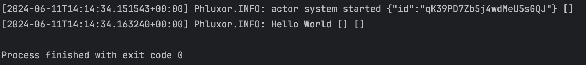

# Hello World

このガイドでは、Phluxorを使用してかんたんな「Hello World」を作成し、  
アクターシステムとアクター、そしてメッセージの基本を理解する方法について説明します。  

## Create Actor System

アクターシステムは、アクターのライフサイクルを管理する中心に位置するものです。  
アクターの作成と監視を行います。  

```php
\Swoole\Coroutine\run(function () {
    \Swoole\Coroutine\go(function () {
        $system = \Phluxor\ActorSystem::create();

    });
});
```

アクターシステムを作成するには、`ActorSystem::create()`メソッドを使用します。  
これでアクターシステムが作成され、アクターの作成やメッセージの送受信が可能になります。  

## メッセージを作ろう

アクターはメッセージを送信することで他のアクターと通信します。  
ここでは、`Hello`というメッセージを作成します。  

```php
namespace Phluxor\Examples;

class Hello
{
    public function __construct(
        public readonly string $who
    ) {
    }
}
```

`Hello`クラスは、`message`プロパティを持つメッセージです。  
このメッセージを使って他のアクターに通信を行います。  

## アクターを作ろう

アクターは、メッセージを受信して処理を行う存在です。  
（アクターモデルではすべてはアクターであると考えます。）  

ここでは、`HelloWorldActor`というアクターを作成します。  
`Hello`メッセージを受信すると、`message`プロパティの値を出力します。  

```php
namespace Phluxor\Examples;

use Phluxor\ActorSystem\Context\ContextInterface;
use Phluxor\ActorSystem\Message\ActorInterface;

class HelloWorldActor implements ActorInterface
{
    public function receive(ContextInterface $context): void
    {
        $msg = $context->message();
        match (true) {
            $msg instanceof Hello => $context->logger()->info(sprintf('Hello %s', $msg->who)),
            default => ''
        };
    }
}

```

アクターとして振る舞うには、`ActorInterface`を実装します。  
`receive()`メソッドは、メッセージを受信したときに呼び出され、  
`ContextInterface`を通じてメッセージやロガーなどの情報にアクセスできます。  

## アクターを登録しよう

生成したアクターをアクターシステムに登録します。  
アクター生成はspawnメソッドを使って行います。  
`$system->root()->spawn()` と記述してアクターを登録します。  

```php
\Swoole\Coroutine\run(function () {
    \Swoole\Coroutine\go(function () {
        $system = \Phluxor\ActorSystem::create();
        $ref = $system->root()->spawn(
            \Phluxor\ActorSystem\Props::fromProducer(fn() => new \PhluxorExample\HelloWorldActor())
        );
    });
});
```

## メッセージを送信しよう

`Hello`メッセージを作成し、アクターに送信します。  
`$system->root()->send()` メソッドを使ってメッセージを送信します。  

```php
$system->root()->send($ref, new \PhluxorExample\Hello('World'));
```

これで、`HelloWorldActor`が`Hello World`というメッセージを出力するアクターが作成されました。  


